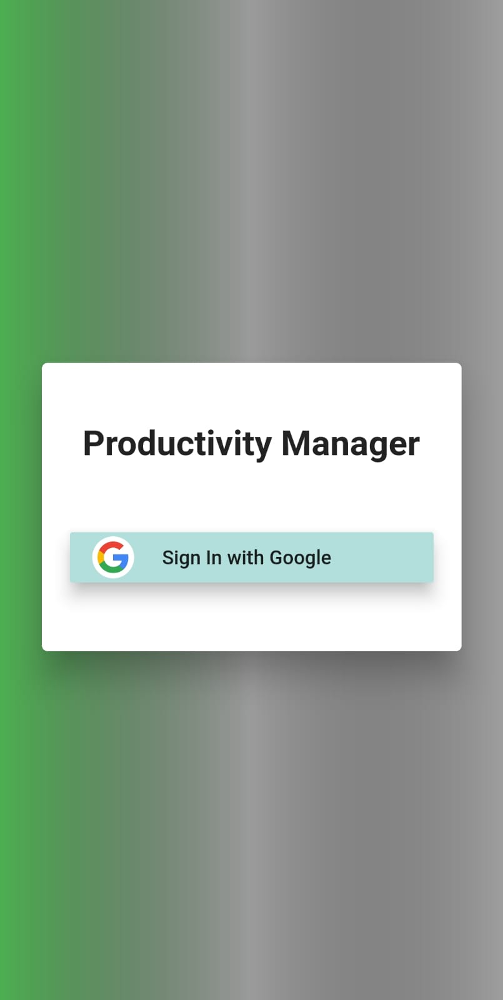
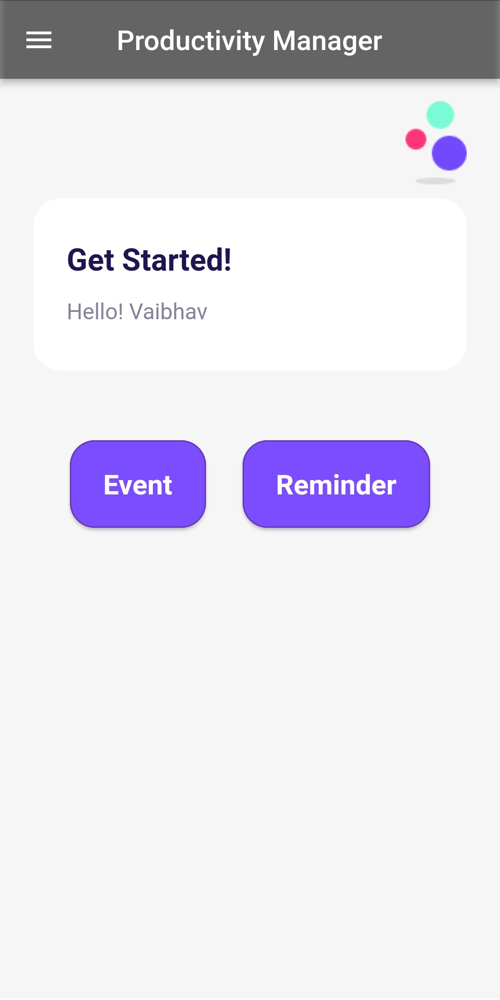
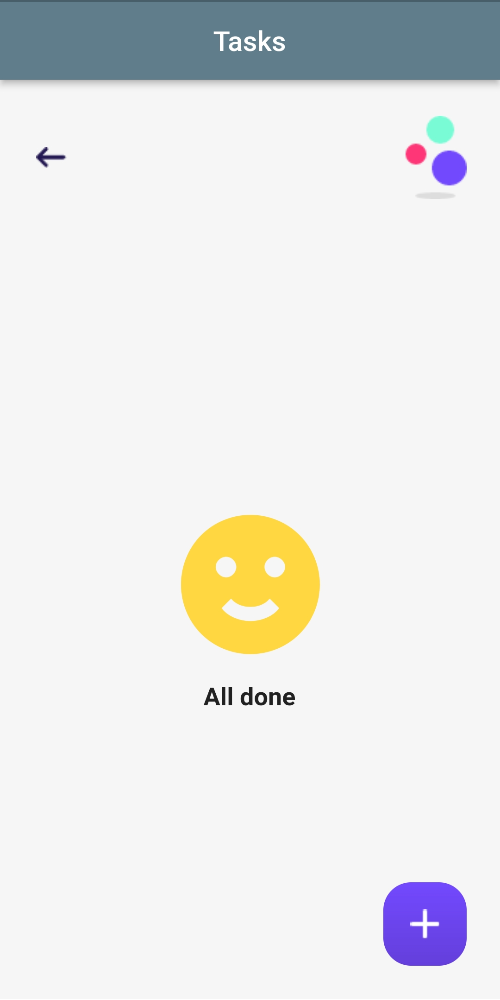
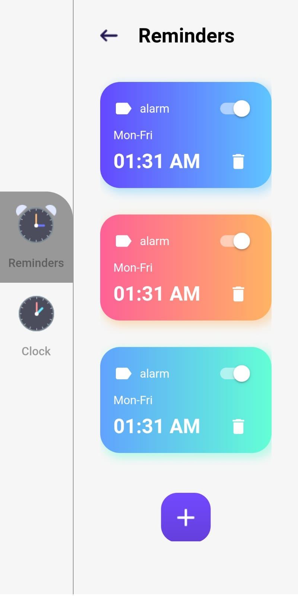
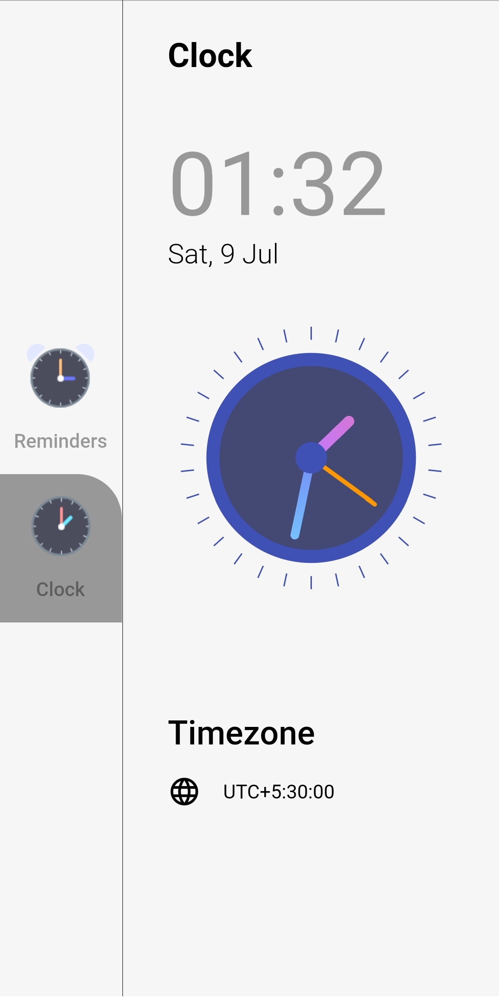

# Productivity Manager

A simple FLutter app that will help users to manage their tasks and schedule reminders.

Built with Dart, Flutter, Firebase and sqflite (SQLite plugin for Flutter).

# Android Screenshots of the Application

     

## Application Features
* Create New Tasks from the Event button.
* Locally store created Task using database file.
* Fetch and Display InComplete Tasks from the locale db file.
* Mark a Task as Done and then delete it.
* Can schedule a reminder from the Reminder button.
* Set the time.
  
---
## Note about the source code

Please note that I was trying my hands on Flutter. Therefore, there are still things which are not fully implemented or tested.
Suggestions and Improvements are most Welcomed!  :)
